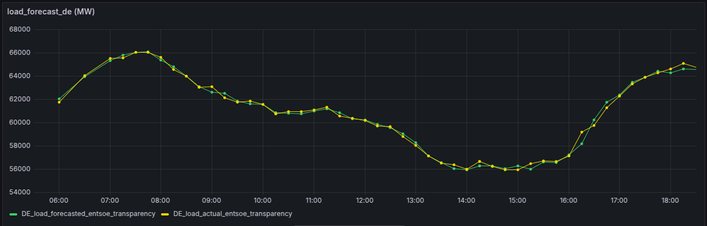

### Time series forecasting of total load of Germany (DE) power grid ###

### Testing ###

#### The project involves following components ####

####  1) Time series forecasting of total power load ####
####  2) Airflow ETL pipeline for extracting realtime data from [ENTSOE](https://transparency.entsoe.eu/load-domain/r2/totalLoadR2/show?name=&defaultValue=false&viewType=TABLE&areaType=BZN&atch=false&dateTime.dateTime=18.03.2025+00:00|UTC|DAY&biddingZone.values=CTY|10Y1001A1001A83F!BZN|10Y1001A1001A82H&dateTime.timezone=UTC&dateTime.timezone_input=UTC), transform data for time series lag, prediction and loading to MySQL database ####
####  3) Grafana dashboard connected with MySQL to visualize forecasted & actual load values ####



#### Prerequisites for Inference ####

#### 1) Airflow  ####
#### 2) MySQL ####
#### 3) Grafana- Server ####

#### Make sure to change the dags folder path in ~/airflow/airflow.cfg ####

```commandline
$ cd dags
$ airflow webserver
$ airflow scheduler
# open 0.0.0.0:8080 and enable load_forecast_de_dag_2 dag  
```

